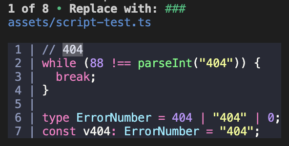

# Fris

_CLI to find and replace text within syntax scopes_


## About

Fris, Find and Replace In Scopes, is a command line application to find and replace text in syntax scopes. For example, you can use fris to replace all the occurrences of `code` with `codeSnippet` excluding those that are found within strings.

## Installation

```bash
npm install fris -g
```

## Usage

### Help

```bash
fris --help
```

Output:

```
FRIS, Find and Replace In Scopes

  Usage:
    fris <file_path> <find_pattern> <replacer> [options]
    fris -t THEME | --theme=THEME
    fris -p | --picker
    fris -h | --help
    fris --version

  Options:
    -h --help                        Show this screen.
    --version                        Show version.
    -t THEME --theme=THEME           Set a new code highlighting theme.
    -p --picker                      Show the picker and autofill with other present options.
    -r --regex                       Use regex when finding and replacing.
    -a --all                         Replace all occurrences without prompting.
    -s SCOPE --scope=SCOPE           Scope to find all occurrences within.
    -i SCOPE --ignore=SCOPE          Scope to ignore all found occurrences within.
    -l LANGUAGE --language=LANGUAGE  Language to tokenize the code with

  User Actions:
    Picker:
      Use enter to submit the answer.
      Use arrow keys or tab to navigate between no / yes prompts
    Find and Replace:
      Use ^C or Q to quit
      Use enter or R to replace the result
      Use arrow keys to navigate between results
```

### Command Line Arguments

```bash
fris <file_path> <find_pattern> <replacer> [options]
```

Fris can be run with all the configuration provided by the command line.

#### Example

```bash
fris path/to/file.js "code" "codeSnippet" -i "string.**"
```

#### \<file_path\>

The location of the file to complete the finding and replacing on.

#### \<find_pattern\>

The pattern to use to find the results with. Tokens can span only one line, so patterns with multiple lines will not find any results.

#### \<replacer\>

The text to replace the results with.

#### -r | --regex

If present, treat `find_pattern` as regex. Note that the start of a token will correlate to `^` and the end to `$` instead of the start/end of the file or line. The regex also supports capture groups.

#### -a | --all

If present, replace all results instead of picking individual results to replace.

#### -s SCOPE | --scope=SCOPE

Only results that are in the scope provided will be found. The scope can be a glob-like pattern. For example, `*` matches one section and `**` match any section. If the pattern is `string.**`, all the following scopes will match it: `string.quoted.single.ts`, `string.quoted.double.ts` and `string.template.ts`.

#### -i SCOPE | --ignore=SCOPE

Only results that are in **not** the scope provided will be found. The scope can be a glob-like pattern. For example, `*` matches one section and `**` match any section. If the pattern is `string.**`, all the following scopes will match it: `string.quoted.single.ts`, `string.quoted.double.ts` and `string.template.ts`.

#### -l LANGUAGE | --language=LANGUAGE

Fris tries to infer the language of the code based on the file extension. You can use this flag to specify the language if the file extension is not a valid language alias, or to overload the default language.

#### -p | --picker

When present, the program will open a visual picker for all of the arguments above. If a argument was present in the command, the default value of that question in the the picker will be the argument.

### Picker


The picker is a menu that can make it easier to run fris without remembering all the arguments.

```bash
fris -p
# or
fris --picker
```

To submit the answer to a question, press <kbd>Enter</kbd>. Use the arrow keys or <kbd>Tab</kbd> to navigate between `no / yes` questions. You may be prompted to enter a language if the file extension is not a valid alias. If you do, you can find a language by typing the start and autocomplete will attempt to find the language. You can still navigate the languages using the arrow keys and use <kbd>Enter</kbd> to submit the answer.

### Replacing Individual Results



When replacing individual results, you are shown the number of results and a code snippet that shows where the result is found. You can press <kbd>Enter</kbd> or <kbd>R</kbd> to replace the result. Use the arrow keys to navigate between results. To quit the program, type <kbd>^C</kbd> or <kbd>Q</kbd>.

### Changing Theme

```bash
fris -t THEME
# or
fris --theme=THEME
# or
fris -t
```

To change the colour theme of the code highlighting you can use one of the commands above and provide a valid theme name or use autocomplete in the picker to pick a theme. The colours that will appear in the terminal are not the exact same as those that are part of the theme because they must be converted to [ansi 256](https://www.ditig.com/256-colors-cheat-sheet).

## Help

If you are using VSCode as a editor you can see what scopes a token belongs to using the [scope inspector](https://code.visualstudio.com/api/language-extensions/syntax-highlight-guide#scope-inspector).

1. Press <kbd>⌘</kbd> + <kbd>Shift</kbd> + <kbd>P</kbd> or <kbd>F1</kbd> to show the command palette.
2. Type in `Developer: Inspect Editor Tokens and Scopes`
3. Press enter.
4. Click the token you want to inspect.
5. The scopes will be listed beside `textmate scopes`.
6. To Exit the scope inspector, you can enter the command .palette, type in `Developer: Inspect Editor Tokens and Scopes` and press enter, like how you originally entered the inspector.
7. Alternatively, you can create a keybinding to enter and exit the scope inspector.
